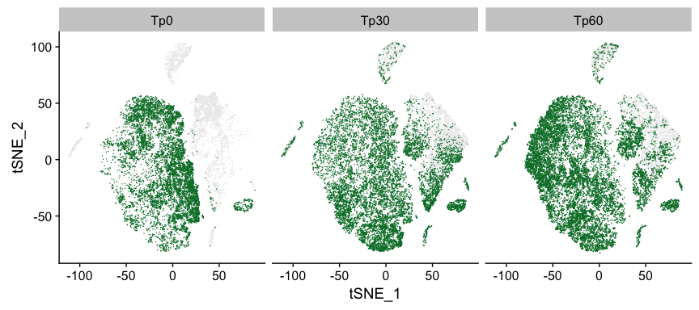
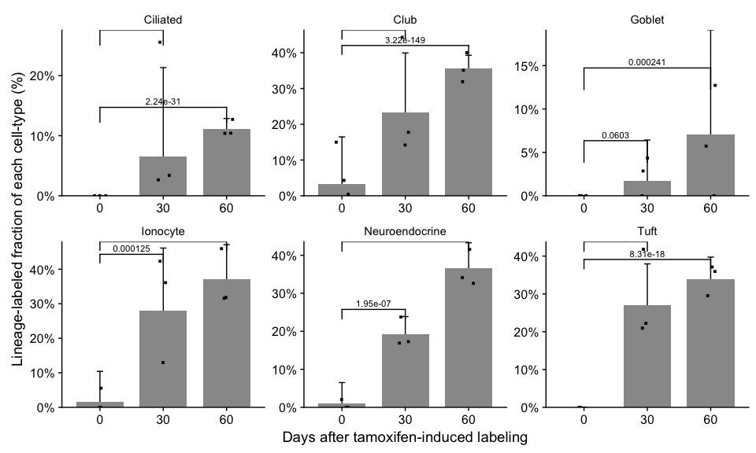
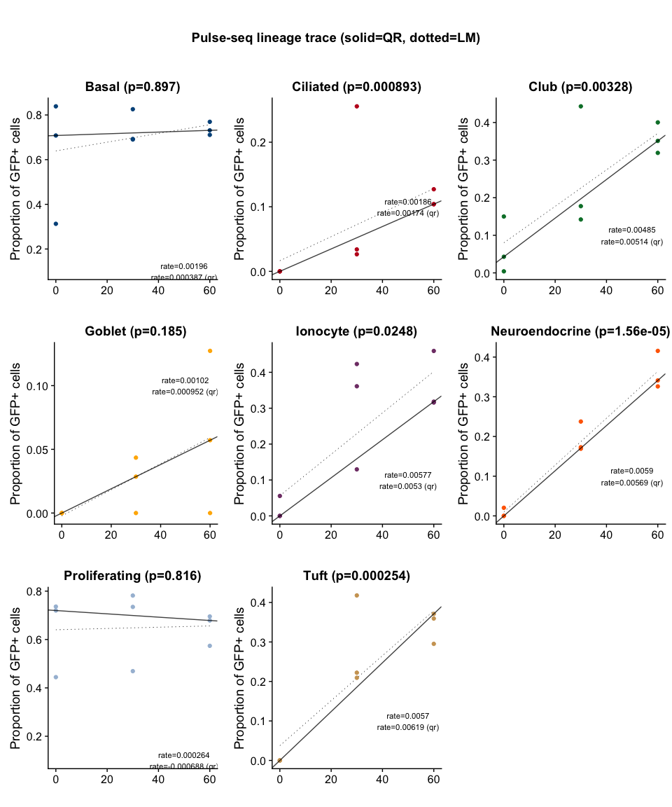
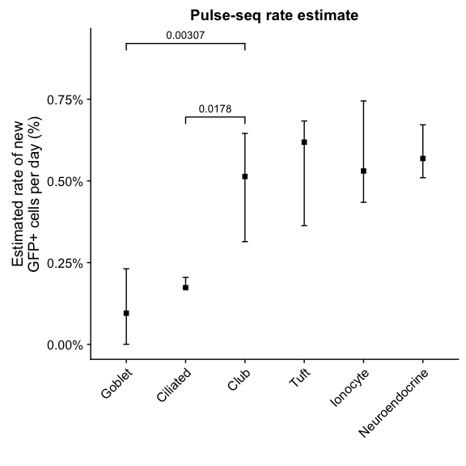

Analysis of 'pulse-seq' lineage trace of 65,265 airway epithelial cells
================

Load required R packages
------------------------

### Can be installed using 'install.packages'

``` r
library(NMF)
library(RColorBrewer)
library(statmod)
library(ggplot2)
library(cowplot)
library(Seurat)
library(Matrix)
library(stringr)
library(plyr)
library(ggsignif)
library(reshape2)
library(quantreg)
### Load all the required functions for this analysis
source("Fxns.R")
```

### Load UMI count data from GEO and pre-computed clustering and dimensionality reduction 
``` r
## Downloading UMI count data
#download.file("ftp://ftp.ncbi.nlm.nih.gov/geo/series/GSE92nnn/GSE92332/suppl/GSE92332_atlas_UMIcounts.txt.gz", destfile="GSE92332_atlas_UMIcounts.txt.gz")
## Reading UMI count data from file
## Note that processed UMI data already has ~500 contaminating immune (dendritic) cells, and all low quality (<1000 genes detected) cells removed
ps_umis = readRDS("PulseSeq_UMI_counts.rds")
info(sprintf("Data dimensions: %s" , paste(dim(ps_umis), collapse = "x")))
```

    ## 2018-07-29 15:05:45 INFO: Data dimensions: 27998x66265

``` r
ps = CreateSeuratObject(raw.data=ps_umis,min.cells = 0, min.genes = 0)
ps = NormalizeData(object = ps,normalization.method = "LogNormalize", scale.factor = 10000,display.progress = TRUE)
ps@dr = readRDS("dr.rds")
ps@meta.data= read.delim("meta_data_regressed.txt")
rownames(ps@meta.data) = ps@cell.names
rownames(ps@dr$tsne@cell.embeddings) = ps@cell.names
```

Plot the t-SNE, with cells split by time-point (Fig 3b)
-------------------------------------------------------

### Run PCA, t-SNE

``` r
d = FetchData(ps, c("timepoint", "color", "res.2_named", "tSNE_1", "tSNE_2"))
g = ggplot(d, aes(x=tSNE_1, y=tSNE_2)) + geom_point(data=subset(d, color=="Tom"), size=0.45, stroke=0, color="grey92") + geom_point(data=subset(d, color!="Tom"), size=0.5, stroke=0, color=default.cols(3)[3]) + facet_wrap(~timepoint)
print(g)
```



Estimate the fraction of lineage-positive (GFP+) cells of each type, at each timepoint
--------------------------------------------------------------------------------------

``` r
md = ps@meta.data
use_clust = "res.2_named"
d = as.data.frame.matrix(table(md$batch, md[, use_clust]))
d$timepoint = as.numeric(gsub("Tp", "", str_split_fixed(rownames(d),fixed("_"),3)[,1]))
d$color = str_split_fixed(rownames(d),fixed("_"),3)[,3]
d$batch = paste(str_split_fixed(rownames(d),fixed("_"),3)[,1], str_split_fixed(rownames(d),fixed("_"),3)[,2], sep = "_")
d = melt(d, id.vars = c("color", "timepoint", "batch"))
colnames(d)[4] <- "celltype"
d$celltype_batch = paste0(d$celltype, d$batch)
totals = aggregate(d$value, by=list(d$celltype_batch), FUN=sum)
d = subset(d, color=="GFP")
d$total <- NA
d$total[match(d$celltype_batch, totals$Group.1)] <- totals$x
d$celltype_batch <- NULL
d$green_frac = d$value / d$total
d$green_frac[!is.finite(d$green_frac)] <- 0
d$tp_cell = paste(d$celltype, d$timepoint, sep="_")
d = plyr::ddply(d, .(tp_cell), summarize, gfp_frac_mean=mean(green_frac), gfp_frac_sd=sd(green_frac), gfp_frac_sem = sd(green_frac)/sqrt(length(green_frac)), 
          gfp_frac_glmm = meta_prop(value, total)$x, gfp_frac_glmm_ci95_low = meta_prop(value, total)$ci95.low, gfp_frac_glmm_ci95_high = meta_prop(value, total)$ci95.high)
d$celltype = str_split_fixed(d$tp_cell,fixed("_"),2)[,1]
d$timepoint = str_split_fixed(d$tp_cell,fixed("_"),2)[,2]
write.table(d, file="pulse_seq_labeled_frac.txt", sep = "\t", quote=F, row.names = F)
```

### Compute the p-values for increasing labeled fraction (using negative binomial regression)

``` r
cell.order = c("Club", "Ciliated", "Goblet", "Tuft", "Neuroendocrine", "Ionocyte") 
cl = as.character(ps@meta.data$res.2_named)
cols = material.cols[c(3,5,8,10, 13,16,17,18)]
x = as.data.frame.matrix(table(md$batch, md[, use_clust]))
x$timepoint = str_split_fixed(rownames(x),fixed("_"),3)[,1]
x$color = str_split_fixed(rownames(x),fixed("_"),3)[,3]
x$batch = paste(str_split_fixed(rownames(x),fixed("_"),3)[,1], str_split_fixed(rownames(x),fixed("_"),3)[,2], sep = "_")
x = melt(x, id.vars = c("color", "timepoint", "batch"))
x = subset(x, x$variable %in% cell.order)
x$variable= factor(x$variable)
pv_timepoint = vector()
pv_tp30 = vector()
pv_tp60 = vector()
for(i in 1:length(unique(x$variable)))
{
    
    cell = levels(x$variable)[i]
    d = data.frame(subset(x, variable==cell))
    totals = aggregate(d$value, by=list(d$batch), FUN=sum)
    totals = totals[rep(1:nrow(totals),each=2),] 
    d$total = totals$x
    d = subset(d, color=="GFP")
    if(any(d$total==0)){warn("Removing mice that didn't detect this celltype"); d = subset(d, total > 0)}
    ## test timepoint 30 against tp 0
    x1 = subset(d, timepoint != "Tp60")
    nb = MASS::glm.nb(formula = value ~ timepoint + offset(log(as.numeric(x1$total))), data=x1, maxit=1000)#, control=glm.control(trace = 3))
    pv_tp30[i] = anova(nb, test="LRT")$`Pr(>Chi)`[2]
    
    ## test timepoint 60 against tp 0
    x2 = subset(d, timepoint != "Tp30")
    nb = MASS::glm.nb(formula = value ~ timepoint + offset(log(as.numeric(x2$total))), data=x2, maxit=1000) #, control=glm.control(trace = 3))
    pv_tp60[i] = anova(nb, test="LRT")$`Pr(>Chi)`[2]
    
    ## test timepoint
    nb = MASS::glm.nb(formula = value ~ timepoint + offset(log(as.numeric(d$total))), data=d, maxit=1000) #, control=glm.control(trace = 3))
    pv_timepoint[i] = anova(nb, test="LRT")$`Pr(>Chi)`[2]
}
pv = cbind.data.frame(pv_tp30, pv_tp60, pv_timepoint)
rownames(pv) = levels(x$variable)
write.table(pv, file="NB_pvals_timepoint.txt", sep="\t", quote=F)
```

### Draw bar plots showing these fractions (Fig 3c)
``` r
x = as.data.frame.matrix(table(md$mouse, md[, use_clust]))
y = as.data.frame.matrix(table(md$batch, md[, use_clust]))
y$color = str_split_fixed(rownames(y),fixed("_"),3)[,3]
y = subset(y, color == "GFP")
y$color <- NULL
z <- data.frame(mapply("/", y, x))
z$batch = rownames(x)
z$timepoint = gsub("Tp", "", str_split_fixed(z$batch,fixed("_"),2)[,1])
z = melt(z, id.vars = c("timepoint", "batch"))
colnames(z)[3] <- "cell"
z = subset(z, cell %in% (cell.order))
z$cell = factor(z$cell, levels=cell.order)
w = 0.5
pd = position_dodge(width=w)

### compute the locations for significance bars
ann_df = pv
ann_df$cell = rownames(pv)
ann_df = melt(ann_df[,c("pv_tp30", "pv_tp60", "cell")], id.vars = "cell")
colnames(ann_df)[2:3] <- c("end", "p.value")
ann_df$end <- gsub("pv_tp", "", ann_df$end)
ann_df$start <- "0"
ann_df$label = signif(ann_df$p.value, 3)
#ann_df$label = symnum(ann_df$p.value, corr = FALSE, na = FALSE, cutpoints = c(0, 0.001, 0.01, 0.05, 0.1, 1), symbols = c("***", "**", "*", ".", "NS"))
ann_df$y = compute_signif_height(ann_df, z)
ann_df = subset(ann_df, cell %in% cell.order)
sb = geom_signif(data=ann_df, aes(xmin=start, xmax=end, annotations=label, y_position=y), textsize = 3, vjust = -0.2, manual=TRUE, tip_length=0.025)

g = ggplot(z, aes(x=timepoint, y=value))   
bar_color = "grey60"
bar_width = 0.75
d = read.delim("pulse_seq_labeled_frac.txt")
d[is.na(d)] <- 0
d$timepoint = as.character(d$timepoint)
colnames(d)[grep("celltype", colnames(d))] <- "cell"
d = subset(d, cell %in% cell.order)
g = g + geom_errorbar(data=d, aes(x=timepoint, y =gfp_frac_glmm, ymin=gfp_frac_glmm_ci95_low, ymax=gfp_frac_glmm_ci95_high), width=.1) + geom_bar(data=d, aes(x=timepoint, y=gfp_frac_glmm),color=NA, fill=bar_color, stat = "identity", position=pd, width=bar_width, color=NA)
g = g + geom_jitter(width=0.1, size=1, shape=15, color="black") + facet_wrap(~cell, scales="free") + ylab("Lineage-labeled fraction of each cell-type (%)") + xlab("") + theme(strip.text.x = element_text(size = 11), strip.background = element_blank()) + scale_y_continuous(labels = scales::percent, expand=c(0,0)) + xlab("Days after tamoxifen-induced labeling") 
print(g + sb)
```




Estimating the turnover rate of the cells and inferring their lineage (Fig 3d)
------------------------------------------------------------------------------

``` r
d = as.data.frame.matrix(table(md$batch, md[, use_clust]))
d$timepoint = as.numeric(gsub("Tp", "", str_split_fixed(rownames(d),fixed("_"),3)[,1]))
d$color = str_split_fixed(rownames(d),fixed("_"),3)[,3]
d$batch = paste(str_split_fixed(rownames(d),fixed("_"),3)[,1], str_split_fixed(rownames(d),fixed("_"),3)[,2], sep = "_")
d = melt(d, id.vars = c("color", "timepoint", "batch"))
colnames(d)[4] <- "celltype"
pv = vector()
plots = list()
coeff = vector()
coeff_lwr = vector()
coeff_upr = vector()
pv_qr = vector()
coeff_qr = vector()
coeff_lwr_qr = vector()
coeff_upr_qr = vector()
rq.se = "boot"
boot_ci = F
cols = default.cols(9)
for(i in 1:length(unique(d$celltype)))
{
    cell = unique(d$celltype)[i]
    x = data.frame(subset(d, celltype==cell))
    totals = aggregate(x$value, by=list(x$batch), FUN=sum)
    totals = totals[rep(1:nrow(totals),each=2),] 
    x$total = totals$x
    x = subset(x, color=="GFP")
    x$green_frac = x$value / x$total
    x$green_frac[!is.finite(x$green_frac)] <- 0
    ### collect regression coefficient, confidence interval and p-value from a linear regression (conditional mean)
    lin_model <- lm(green_frac ~ timepoint, data = x)
    m = anova(lin_model, test="LRT")
    pv[i] = m$`Pr(>F)`[1]
    coeff[i] <- lin_model$coefficients[2]
    ci = confint(lin_model,level=0.95)
    coeff_lwr[i] = ci["timepoint",][1]
    coeff_upr[i] = ci["timepoint",][2]
    ### collect regression coefficient, confidence intervals and p-value from a quantile regression (conditional median)
    qr_lin_model <- quantreg::rq(green_frac ~ timepoint, data = x, tau = .5, ci=T)
    ### compute confidence intervals for the slope using bootstrap
    s = summary.rq(qr_lin_model)$coefficient
    coeff_qr[i] <-s["timepoint", "coefficients"]
    coeff_lwr_qr[i] = max(s["timepoint", "lower bd"], 0)
    coeff_upr_qr[i] = s["timepoint", "upper bd"]
    s = summary.rq(qr_lin_model, se = "boot")$coefficient
    pv_qr[i] = s["timepoint", "Pr(>|t|)"]
    ### draw the plot for this celltype
    plots[[i]] <- make_plot(x, lin_model, quant_reg_model = qr_lin_model, title = sprintf("%s (p=%s)", cell, signif(pv_qr[i], 3)), pt.col = cols[i], rq.se = rq.se, rq.ci = F)
}

### Plot all the quantile regression fits. (Extended Data Fig 6c)
names(pv) <- unique(d$celltype)
fdr = p.adjust(pv)
title <- ggdraw() + draw_label("Pulse-seq lineage trace (solid=QR, dotted=LM)", fontface='bold')
pg = cowplot::plot_grid(plotlist = plots)
print(plot_grid(title, pg, ncol=1, rel_heights=c(0.1, 1)))
```



### Test the difference in regression slope (rate of new lineage-labeled cells) to infer lineage (Fig 3d)

``` r
cells.show = c("Goblet", "Ciliated", "Ionocyte", "Tuft", "Club", "Neuroendocrine")
model_data = cbind.data.frame(pv, coeff, coeff_lwr, coeff_upr)
model_data_qr = cbind.data.frame(pv_qr, coeff_qr, coeff_lwr_qr, coeff_upr_qr)
colnames(model_data_qr) = colnames(model_data)
model_data$fit = "lm"
model_data_qr$fit = "qr"
md = rbind.data.frame(model_data, model_data_qr)
md$celltype = factor(rep(unique(d$celltype), 2), levels=unique(d$celltype)[order(model_data$coeff)])
fit.use = "qr"
md_show = subset(md, celltype %in% cells.show & fit == fit.use)

annotation_df <- compute_pvals(d, show.pairs = to_all_pairs(cells.show), test.use = "rank", linear = F, se="boot")
annotation_df$y <- compute_signif_height_slope(an_dt = annotation_df, full_dt = md_show, adj = 0.0005)
annotation_df$sig = symnum(annotation_df$p.value, corr = FALSE, na = FALSE, cutpoints = c(0, 0.001, 0.01, 0.05, 0.1, 1), symbols = c("***", "**", "*", ".", "NS"))
annotation_df = subset(annotation_df, p.value < 0.05)
annotation_df = annotation_df[c(3,7),]
dy = 0.0015 # cosmetics: move the significance bars around
annotation_df$y[annotation_df$start=="Goblet"] = annotation_df$y[annotation_df$start=="Goblet"]  + dy*1.5
g = ggplot(md_show, aes(x=celltype, y=coeff)) + geom_point(shape=15, size=2) + geom_errorbar(aes(ymin=coeff_lwr, ymax=coeff_upr), width=.1) + xlab("") + theme(axis.text.x =element_text(angle=45, hjust=1)) + ylab("Estimated rate of new\nGFP+ cells per day (%)") + scale_y_continuous(labels = scales::percent) + ggtitle("Pulse-seq rate estimate")
signif_bars = geom_signif(data=annotation_df, aes(xmin=start, xmax=end, y_position=y, annotations=signif(p.value,3)),  textsize = 3.5, vjust = -0.2, manual=TRUE, tip_length=0.0002) 
print(g + signif_bars)
```


